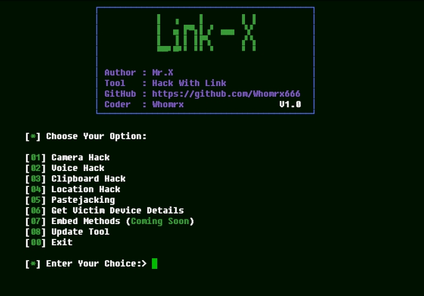

# Link-x


## introduction
This Tool can Hack and Grab data of Camera, Voice, Clipboard, Location.It can Grab As much info as Possible from Victims Device.All this requires Just a Malicious Link! {UPDATED V.2.0}

## Instalations
```
$ pkg update -y
$ pkg upgrade -y
$ pkg install python git -y
$ git clone https://github.com/Whomrx666/Link-x
$ cd Link-x
$ python setup.py
$ python Link-x.py
```
### Attack Methods:
* Camera Hack
* Voice Hack
* Clipboard Hack
* Location Hack
* ClickJacking
* Get Victim Device Details

### Tunnel Methods:
* Localhost ssh for public share

### Methods Overview:
* Camera Hack
> Hack Victim's front Camera and take one image then direct the link to the specified link
* Voice Hack
> Hack Victim's Microphone and Record 5 Seconds audio
* Clipboard Hack
> Hack Victim's Clipboard and Grab last copied Text
* Location Hack
> Hack Victim's Location and Show exact Location
* Clickjacking
> Extract device data by waiting for the victim to click the button provided.
* Device Details
> Probably my favorite Attack Method. Grab the much Information as possible from Victim's Device. Including: Screen Info, Battery Info, Connection Info, Country Info etc...

## Instructions
- **One**: Install the tools according to the instructions above
- **Two**: Choose the type of attack you want
- **Three**: Select the link you want to use, you can use the default or mask URL.
- **Four**: The link will be automatically created and share the link to the specified target.
- **Done**: And boom you will get what you want

## Observation
This is a tool for education only, I am not responsible for any misuse
### Original Author
<a href="https://github.com/Whomrx666"></a>

### <<< If you copy , Then Give me The Credits >>>

## CONNECT WITH ME :

[](https://whomrxhackers.blogspot.com/)
[](https://twitter.com/whomrx666)
[](https://wa.me/6285926601133?text=Halo%2C%20Mr.X)
[](https://www.facebook.com/whomrx.666)
[](https://t.me/Whomr_X)
[](mailto:whomrx666@gmail.com)
[](https://www.tiktok.com/@whomr.x)

**If you want to donate, click on the button**
<a href="https://saweria.co/whomrx"></a>

---

<p align="left">
  
</p>

---